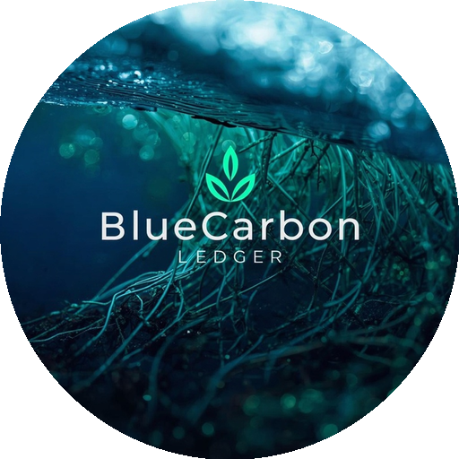

# BlueCarbon-LEDGER AI Chatbot 🌊

A professional AI-powered chatbot for blue carbon research and analysis with advanced features including web search, image integration, multi-language translation, and intelligent document processing.



## ✨ Features

- 🤖 **AI-Powered Responses** - Intelligent answers using Groq AI
- 📄 **PDF Analysis** - Upload and analyze PDF documents
- 🌐 **Web Search Integration** - Real-time web search with SerpAPI
- 🖼️ **Image Support** - Automatic image fetching for visual queries
- 🌍 **Multi-Language Translation** - Support for 50+ languages including Indian languages
- 💬 **Chat History** - Persistent chat sessions with delete functionality
- 📊 **Smart Source Management** - Separate dataset and web sources
- 🎨 **Modern UI** - Clean, responsive interface with dark mode support

---

## 📋 Prerequisites

Before installing, make sure you have:

- **Python 3.8 or higher** ([Download Python](https://www.python.org/downloads/))
- **pip** (Python package manager - comes with Python)
- **Git** (optional, for cloning the repository)

---

## 🚀 Quick Start Installation

### Step 1: Download the Project

**Option A: Using Git**
```bash
git clone <your-repository-url>
cd carbon-chatbot
```

**Option B: Manual Download**
1. Download the project ZIP file
2. Extract it to a folder
3. Open terminal/command prompt in that folder

### Step 2: Install Dependencies

**Windows:**
```bash
pip install -r requirements.txt
```

**Mac/Linux:**
```bash
pip3 install -r requirements.txt
```

### Step 3: Configure API Keys

1. Open the `.env` file in the `carbon-chatbot` folder
2. Add your API keys:

```env
# Required: Groq AI API Key (Free at https://console.groq.com)
GROQ_API_KEY=your_groq_api_key_here

# Optional: SerpAPI Key for web search (Free tier at https://serpapi.com)
SERPAPI_KEY=your_serpapi_key_here

# Optional: LibreTranslate for translation (or use Google Translate)
LIBRETRANSLATE_URL=https://libretranslate.com
```

**How to get API keys:**
- **Groq API**: Visit [https://console.groq.com](https://console.groq.com) → Sign up → Get API key (Free)
- **SerpAPI**: Visit [https://serpapi.com](https://serpapi.com) → Sign up → Get API key (100 free searches/month)

### Step 4: Run the Application

**Windows:**
```bash
python app.py
```

**Mac/Linux:**
```bash
python3 app.py
```

### Step 5: Access the Chatbot

Once the server starts, you'll see:
```
🌐 ACCESS URLS:
   Local:    http://localhost:5000
   Network:  http://10.23.169.230:5000
```

Open your browser and go to: **http://localhost:5000**

---

## 🎯 Usage Guide

### Basic Chat
1. Type your question in the input box
2. Press Enter or click Send
3. The AI will respond with intelligent answers

### Upload PDF Documents
1. Click the 📎 attachment icon
2. Select a PDF file (blue carbon related)
3. Wait for processing (30-60 seconds)
4. Ask questions about the uploaded document

### Web Search & Images
- Ask questions like "show me blue carbon cycle images"
- The AI automatically decides when to fetch images (0-3 based on query)
- Web sources are clickable, dataset sources are informational

### Multi-Language Translation
1. Click the 🌐 translate button on any message
2. Select your target language
3. The message will be translated instantly

### Chat History
- All chats are automatically saved
- Click on any chat in the sidebar to load it
- Hover over a chat and click 🗑️ to delete it
- Click "New Chat" to start a fresh conversation

---

## 🔧 Configuration

### Customize Settings

Edit `config.py` to customize:

```python
# Server settings
HOST = "0.0.0.0"  # Change to "127.0.0.1" for local only
PORT = 5000

# AI Model settings
GROQ_MODEL = "llama-3.3-70b-versatile"  # Change AI model

# File upload settings
MAX_FILE_SIZE = 10 * 1024 * 1024  # 10MB max file size
ALLOWED_EXTENSIONS = {'.pdf', '.txt', '.docx'}
```

### Add Your Own PDFs

Place PDF files in the `data/pdfs/` folder to make them available for analysis.

---

## 🛠️ Troubleshooting

### Common Issues

**1. "Module not found" error**
```bash
pip install -r requirements.txt --upgrade
```

**2. "Port 5000 already in use"**
- Change PORT in `config.py` to 5001 or another available port

**3. "Groq API error"**
- Check your API key in `.env` file
- Verify you have API credits at https://console.groq.com

**4. "Web search not working"**
- Add SerpAPI key to `.env` file
- Or set `force_disable = True` in `services/web_search_service.py`

**5. "PDF processing failed"**
- Ensure PDF is not password protected
- Check file size is under 10MB
- Verify PDF contains extractable text

### Reset Everything

To start fresh:
```bash
# Delete chat history
rm -rf data/chat_history/*.db

# Delete vector store
rm -rf data/vectorstore/*

# Restart the application
python app.py
```

---

## 📁 Project Structure

```
carbon-chatbot/
├── app.py                      # Main application
├── config.py                   # Configuration settings
├── requirements.txt            # Python dependencies
├── .env                        # API keys (create this)
├── templates/
│   └── index.html             # Frontend UI
├── static/
│   └── assets/                # Images and logos
├── services/                  # Backend services
│   ├── simple_chat_engine.py # AI chat logic
│   ├── web_search_service.py # Web search integration
│   ├── translation_service.py# Translation service
│   └── ...                    # Other services
├── data/
│   ├── pdfs/                  # PDF storage
│   ├── vectorstore/           # Document embeddings
│   └── chat_history/          # Chat sessions
└── models/
    └── response_models.py     # Data models
```

---

## 🌟 Advanced Features

### AI-Driven Decisions

The chatbot uses AI to intelligently decide:
- **Web Search**: Automatically determines if web search is needed
- **Image Count**: Decides how many images to show (0-3) based on query
- **Source Priority**: Prioritizes uploaded files over general knowledge

### Smart Image Detection

Queries like these trigger automatic image fetching:
- "show me blue carbon cycle"
- "explain mangrove restoration with images"
- "what does seagrass look like"

### Translation Support

Supports 50+ languages including:
- **Indian Languages**: Hindi, Tamil, Telugu, Bengali, Marathi, Gujarati, Kannada, Malayalam, Punjabi, Urdu
- **Continental Languages**: Spanish, French, German, Italian, Portuguese, Russian, Chinese, Japanese, Korean, Arabic

---

## 🔒 Security Notes

- Never commit your `.env` file with API keys to public repositories
- Use environment variables for production deployments
- Limit file upload sizes to prevent abuse
- Run behind a reverse proxy (nginx) for production

---

## 📝 License

This project is for educational and research purposes.

---

## 🤝 Support

For issues or questions:
1. Check the Troubleshooting section above
2. Review the configuration settings
3. Check API key validity
4. Ensure all dependencies are installed

---

## 🎉 Enjoy Your BlueCarbon-LEDGER Chatbot!

Your professional AI assistant for blue carbon research is ready to use. Start asking questions and exploring the features!

**Happy Chatting! 🌊**
